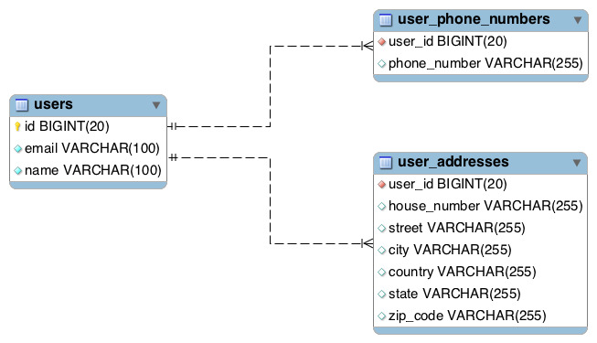

# JPA/Hibernate ElementCollection Spring Boot Example

Illustrates the mapping of a collection of basic and embeddable types using JPA’s _@ElementCollection_ and 
_@CollectionTable_ annotations.

Credits: [Rajeev Singh](https://www.callicoder.com/hibernate-spring-boot-jpa-element-collection-demo/)